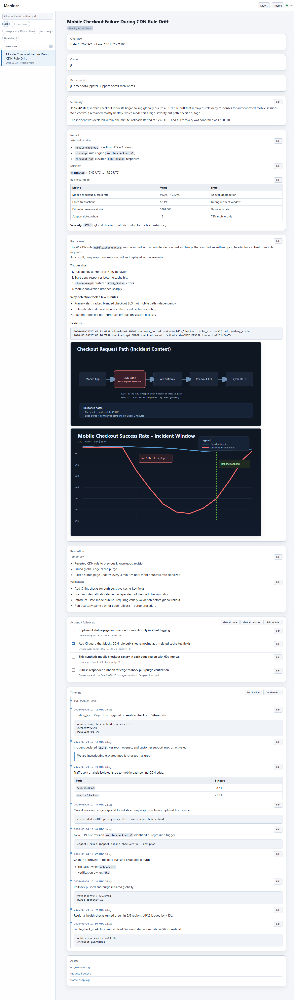

# Examples

These folders are sample incidents for **Mortician**: they show what captured postmortems look like on disk and how the dashboard presents them.

To try them locally, copy or move each example bundle into your project’s `incidents/` directory (next to where you run the CLI), then start the app with `mortician serve` and open the dashboard in your browser.
